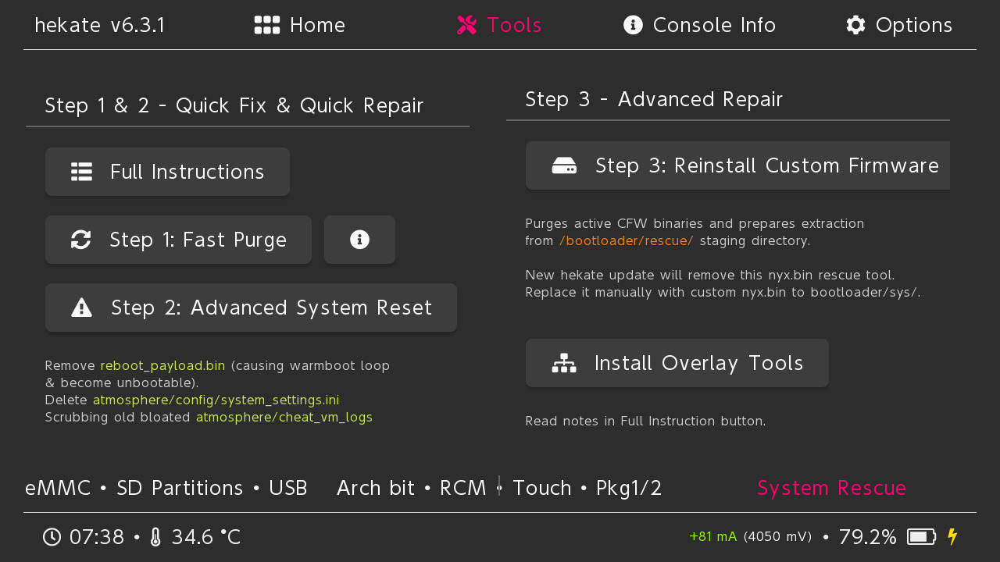
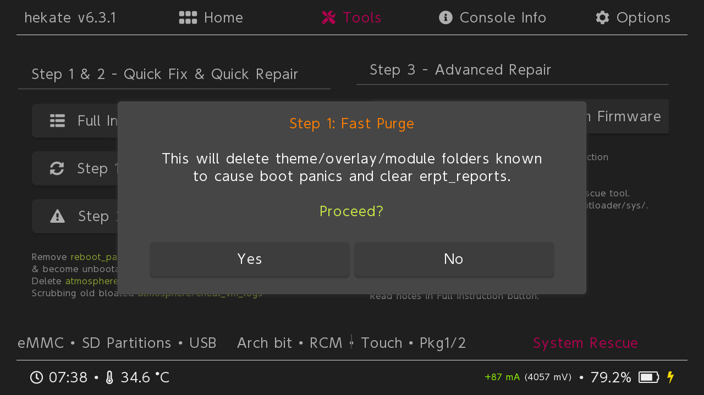
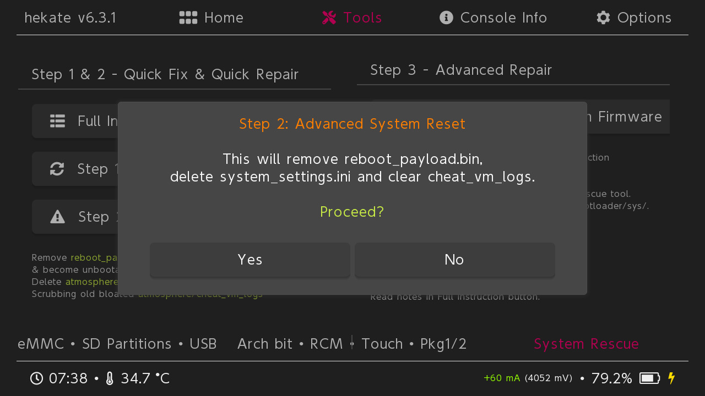
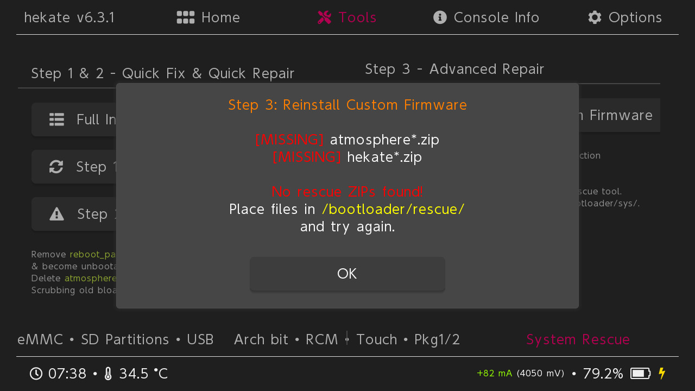
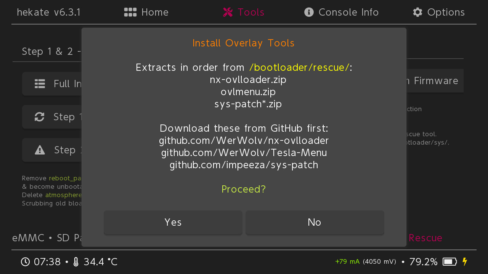

# Hekate Nyx Rescue MOD (Alpha)

A custom fork of Nyx (Hekate GUI) designed to help recover Nintendo Switch consoles that fail to boot into Atmosphere due to common SD card, configuration, theme, overlay, or firmware-update related issues.

> ⚠️ **ALPHA SOFTWARE**
>
> This project is experimental and intended for advanced users only.
>
> If you do not understand Atmosphere, Hekate, emuMMC, payload injection, SD card structure, or manual recovery procedures, **do not use this software**.
>
> You are solely responsible for any damage, data loss, corruption, or boot issues resulting from its use.

---

## Purpose

Many Atmosphere boot failures are caused by:

* Outdated atmosphere
* Outdated overlays
* Outdated sysmodules
* Broken custom themes
* Invalid Atmosphere configuration
* Corrupted Archive Bits
* Firmware updates without updating CFW
* Warmboot payload loops
* Excessive Atmosphere error logs
* Miscellaneous SD card modifications

This project aims to provide a simple "first aid kit" directly inside Nyx so users can perform basic recovery actions with no PC required (Step 1 and 2) or limited PC uses.

THIS TOOLS PURPOSES IS TO FIX UNBOOTABLE CFW AND NOT TO RESTORE PREVIOUS USER CONFIGURATION AND EXPERIENCE.

---

## Screenshot







---

## Features

### Step 1 — Fast Purge

Attempts to remove the most common causes of Atmosphere boot failures.

Actions performed:

* Removes custom Home Menu themes
* Removes User Profile themes
* Removes custom System Settings themes
* Removes Lock Screen modifications
* Removes outdated sys-patch installations
* Removes outdated Tesla Menu components
* Removes corrupted uLaunch replacements
* Clears `atmosphere/erpt_reports`

Recommended as the first troubleshooting step.

---

### Step 2 — Advanced System Reset

For situations where Fast Purge does not resolve the issue.

Actions performed:

* Removes `reboot_payload.bin`
* Deletes `atmosphere/config/system_settings.ini`
* Cleans `atmosphere/cheat_vm_logs`

Useful for:

* Warmboot crash loops
* Broken Atmosphere configuration
* Excessive cheat manager logging

---

### Step 3 — Reinstall Custom Firmware

Performs an in-place Atmosphere and Hekate refresh using packages provided by the user.

Required files:

`/bootloader/rescue/`

Contents:

```text
atmosphere*.zip
fusee.bin (from atmosphere Github)
hekate*.zip
```

Downloads:

Atmosphere:
https://github.com/Atmosphere-NX/Atmosphere/releases

Hekate:
https://github.com/CTCaer/hekate/releases

Operations performed:

1. Creates a backup of the existing Atmosphere installation
2. Extracts Atmosphere to SD root
3. Installs fusee.bin in SD root
4. Updates Hekate files
5. Stages Hekate self-update
6. Renames the Hekate payload as required

---

### Install Overlay Tools

After reinstalling Atmosphere, some users may still be unable to launch installed games.

This usually means required overlays or patches are missing.

Required files:

```text
/bootloader/rescue/

nx-ovlloader.zip
ovlmenu.zip
sys-patch*.zip
```

Downloads:

nx-ovlloader:
https://github.com/WerWolv/nx-ovlloader/releases

Tesla Menu:
https://github.com/WerWolv/Tesla-Menu/releases

sys-patch:
https://github.com/impeeza/sys-patch/releases

Installation order:

1. nx-ovlloader
2. Tesla Menu (ovlmenu)
3. sys-patch

After booting Atmosphere, the patch should be automatically enabled.

If game still not works:

* Open Tesla using:

```text
L + D-Pad Down + Right Stick Click
```

* Enable sys-patch if required

---

## CHEAT Auto-Enable Crash

Some systems crash during boot or game start because cheat auto-enable is enabled globally.

Recommended fix:

Install:

NX Fix Cheat from homebrew app store

Disable:

```text
Enable Cheats by Default
```

---

## Important Notes

### Updating Hekate

When Hekate is updated, the official package replaces:

```text
/bootloader/sys/nyx.bin
```

This removes this Rescue MOD.

After updating Hekate:

1. Restore your custom nyx.bin
2. Copy it back to:

```text
/bootloader/sys/
```

---

### What This Tool Does NOT Fix

This tool cannot repair:

* Damaged eMMC
* Corrupted NAND
* Hardware failures
* Dead SD cards
* Broken emuMMC partitions
* Incorrect fuse states
* RCM hardware problems
* Physical damage

---

## Building

This project is based on:

Hekate:
https://github.com/CTCaer/hekate

Modifications currently consist primarily of:

```text
nyx/nyx_gui/frontend/gui_tools.c
```

plus linker changes in:

```text
nyx/link.ld
```

The project should be built using the standard Hekate build environment.

The built nyx.bin  is in output folder:

```text
/output/nyx.bin
```

---

## Alpha Status

Current status:

```text
ALPHA
```

Expect:

* Bugs
* Incomplete testing
* Unexpected edge cases
* Potential data loss if used incorrectly

Always maintain:

* NAND backups
* BOOT0 backups
* BOOT1 backups
* SD card backups

before using any recovery functionality.

---

## Disclaimer

THIS SOFTWARE IS PROVIDED "AS IS", WITHOUT WARRANTY OF ANY KIND.

The author is not responsible for:

* Bricked consoles
* Data loss
* Save loss
* SD card corruption
* emuMMC corruption
* NAND corruption
* Any direct or indirect damages

By using this software, you acknowledge that you understand the risks and accept full responsibility for any consequences.
